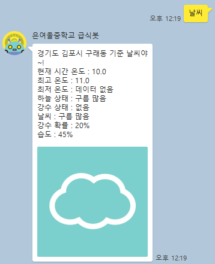
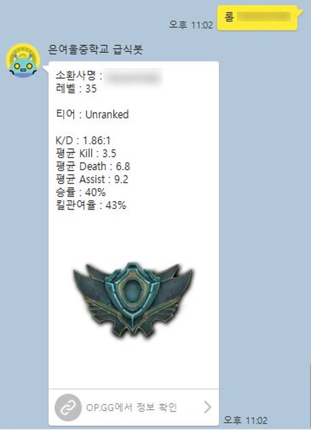
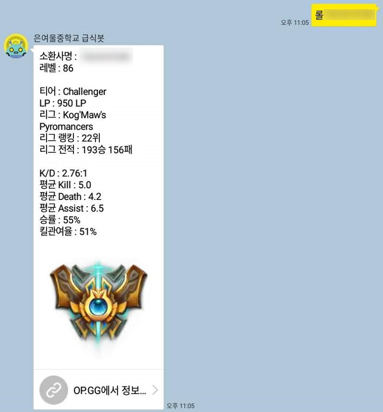
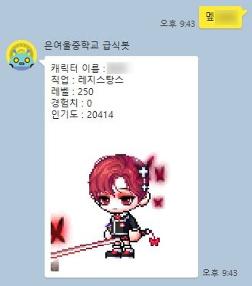

# Eunyeoul Kakaotalk Mealbot with PHP

| Date | Progress |
| :------------- | :------------- |
| 2018.03.08 ~ 2018.03.12 | 제작 |
| 2018.03.13 | 디자인 개선 및 일부 수정 |
| 2018.03.14 | Github에 공개 |
| 2018.03.15 ~ 2018.03.17 | 날씨 파싱 기능 추가 |
| 2018.03.17 ~ 2018.03.18 | League Of Legends 전적([OP.GG](http://www.op.gg/)) 파싱 기능 추가 |
| 2018.03.23 | 3-1 기본 시간표 출력 기능 추가 |
| 2018.03.29 | 3-5 기본 시간표 출력 기능 추가 |
| 2018.03.29 | 메이플스토리 캐릭터 정보 파싱 기능 추가 |
| 2018.04.08 | 기본 시간표 출력 기능 개선, 3-3 기본 시간표 출력 기능 추가 |
| 2018.04.08 | 코드 가독성을 높이기 위한 모듈인 `echoKakao` 개발 후 적용 |

## 급식 파싱
 

- 나이스에서 은여울중학교 급식 데이터를 파싱

- 오늘 급식, 내일 급식, 내일 모레 급식 지원

## 날씨 파싱
 

- 기상청에서 은여울중학교와 가장 가까운 기상대(경기도 김포시 구래동)의 최신 날씨 데이터를 파싱

- 날씨에 따라 다른 이미지 전송

## League of Legends 전적 파싱

- 소환사명을 입력받아 [OP.GG](http://www.op.gg/)에서 전적 데이터를 파싱

- 유저 랭크에 따라 해당 티어 이미지를 표시

- 검색 기록 및 시간 로그 파일에 기록

 

- 티어 분류가 되지 않은 유저의 경우 위와 같이 표시됨

 

- 티어 정보가 존재하는 유저의 경우 위와 같이 표시됨

## 메이플스토리 캐릭터 정보 파싱

 

- 메이플스토리 캐릭터 이름을 입력받아 캐릭터 이름, 직업, 레벨, 경험치, 인기도, 아바타를 출력함

- 추후 랭킹 등 다양한 정보를 제공할 수 있도록 업데이트할 예정

## 3학년 1/3/5반 기본 시간표

- 3학년 1반용만 만들었었는데 5반에서 누가 돈 주는 조건으로 만들어 달라고 해서 추가함 **~~200원 정도 받은 것으로 기억함~~**

- 3반도 의뢰 들어와서 추가함 **~~무려 2원을 얻음~~**

- 기능 구조를 수정해서 유지보수 및 추가가 쉬워짐

- '오늘'의 시간표만이 아니라 '내일'의 시간표도 확인할 수 있도록 수정할 예정임

## Server
<b>닷홈(dothome) 무료 웹호스팅을 이용함 : </b> 
기본 `html` 폴더를 이 저장소에 있는 것으로 덮어씌우고 사이트 링크를 등록하면 됨
